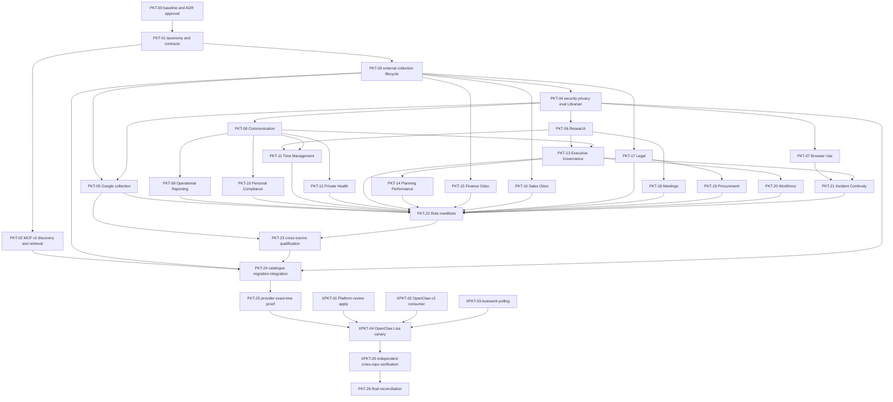

# Dependency Graph and Roadmap

## Graph

## Ordered waves and safe parallelism

| Wave | Ready set | Admission rule | Exit gate |
|---|---|---|---|
| 0 | PKT-00, then PKT-01 | Serial | Founder-approved ADR/schema/protocol direction and frozen contracts |
| 0B | PKT-02 and PKT-03 in parallel; PKT-04 after PKT-03 | Dependency-aware; PKT-04 hardens the lifecycle after its interfaces exist | Provider, lifecycle, and privacy foundations integrate cleanly |
| 1 | PKT-05–PKT-08 | Dependency-parallel | Google manifest plus three shared methods pass focused evals |
| 2 | PKT-09–PKT-12 | Dependency-parallel after required shared methods | Four Lisa families qualify with synthetic fixtures only |
| 3 | PKT-13–PKT-17 | Dependency-ready pool | First five business families qualify |
| 4 | PKT-18–PKT-21 | Dependency-ready pool | Remaining four business families qualify |
| 4B | PKT-22, then PKT-23 | Serial role references and qualification evidence | Five role manifests validate; all intended releases are deliberately classified; no activation occurs |
| 5 | PKT-24, then PKT-25 | Serial shared/generated paths and full proof | Exact provider source candidate proven |
| Cross-repository | XPKT-01–XPKT-03 may proceed once their inputs freeze; XPKT-04 follows provider and consumer readiness | Each owning repository uses its own manifest/lease | Lisa canary and external receipts complete |
| Closeout | XPKT-05, then PKT-26 | Independent verification before closure | Every PRD criterion classified and no unsupported proof claim remains |

The scheduler may admit at most one local and two hosted packets and must reduce concurrency when resource snapshots, leases, path ownership, or interactive pressure are uncertain. “Parallel” means dependency-compatible, not automatically simultaneous.

## Cross-repository gates

- **G1 Platform contract:** authentication claims and technical eligibility fixtures must be frozen before provider conformance; migration review/apply remains Platform-owned.
- **G2 OpenClaw consumer:** standard MCP v2 consumption, exact release verification, local execution, pins, private SQLite state, and rollback are OpenClaw-owned.
- **G3 Autowork:** polling/diff/candidate submission is deterministic and idempotent; qualification and current pointers remain Skills-owned.
- **G4 Brain rules:** Browser Use and standing-rule proposals consume approved Brain rules but cannot create or technically enforce them.
- **G5 Provider-live:** no stage/VPS/production claim until exact source, identity, migrations, endpoint, consumer, and rollback receipts align.

## Critical path

`PKT-00 -> PKT-01 -> PKT-03/PKT-04 -> PKT-05 and shared methods -> Lisa/business content -> PKT-22 -> PKT-23 -> PKT-24 -> PKT-25 -> XPKT-04 -> XPKT-05 -> PKT-26`

MCP completion (PKT-02) may proceed beside the external lifecycle, but it must finish before catalogue integration and any consumer canary.
